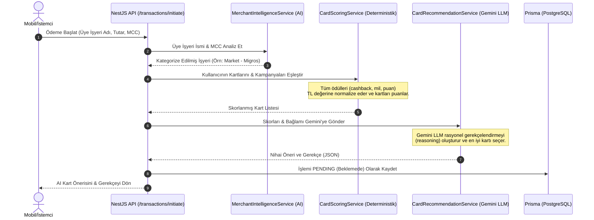

# 💳 SmartPayAI — Yapay Zekâ Destekli Ödeme Yönlendirme ve Kampanya Optimizasyon Motoru

SmartPayAI, kullanıcıların cüzdanlarındaki tüm fiziksel/sanal kredi ve banka kartlarını tek bir merkezden yönetmelerini ve ödeme anında en yüksek finansal getiriyi (nakit iade, puan, mil vb.) sunan kartı otomatik kullanmalarını sağlayan **yapay zekâ destekli bir ödeme optimizasyon ve yönlendirme platformudur**.

### 🌟 Temel Değer Önerisi: Tek Kart, Maksimum Kazanç
Kullanıcılar her ödeme noktasında hangi kartı seçeceğini düşünmek ve kampanyaları takip etmek zorunda kalmaz:
* **Tek Sanal Kart Deneyimi:** Kayıt olan her kullanıcıya tek bir **SmartPay Sanal Kartı** (`VirtualCard`) tanımlanır.
* **Akıllı Yönlendirme (Dynamic Routing):** Kullanıcı alışverişlerinde sadece bu tek sanal kartı kullanır.
* **Arka Planda Optimizasyon:** Ödeme esnasında yapay zekâ, kullanıcının cüzdanına eklemiş olduğu tüm diğer kartları (Saved Cards) ve aktif kampanyaları tarayarak en yüksek kazancı getirecek olan kartı belirler ve ödemeyi arka planda o karta yönlendirir.

Bu proje, **NestJS** ile geliştirilmiş güçlü bir backend servisi ve **Expo (React Native)** ile geliştirilmiş modern bir mobil istemciden oluşur.

---

## 🚀 Proje Nasıl Çalışır? (Çalışma Mantığı)

SmartPayAI'ın temel amacı, bir ödeme anında kullanıcıya en çok kazandıracak kartı seçmektir. Bu süreç 5 adımdan oluşan bir akışla gerçekleştirilir:



### 1. İşlem Başlatma (Initiate Transaction)
Kullanıcı bir mağazada ödeme yaparken mobil uygulama veya API aracılığıyla ödeme başlatır. API'ye gönderilen bilgiler şunlardır:
*   `merchantName` (Üye İşyeri Adı - Örn: "Migros", "Shell", "Zara")
*   `amount` (Harcama Tutarı)
*   `mcc` (Merchant Category Code - Opsiyonel)

### 2. Yapay Zekâ Destekli İşyeri Analizi (Merchant Intelligence)
`MerchantIntelligenceService`, üye işyeri ismini ve MCC kodunu analiz ederek işyerini standart bir kategoriye (market, akaryakıt, giyim, restoran vb.) ve harcama türüne yerleştirir. Bu analiz sonuçları veritabanında önbelleğe (cache) alınır, böylece sonraki işlemlerde hız kazanılır.

### 3. Deterministik Kart Puanlama (Card Scoring Engine)
`CardScoringService` devreye girer:
*   Kullanıcının cüzdanındaki kayıtlı kartları (banka, kredi kartı vb.) ve o an geçerli olan tüm aktif banka kampanyalarını tarar.
*   Kampanya koşullarını (banka, kart tipi, kart şeması/network, harcama limiti) değerlendirerek uygun kampanyaları belirler.
*   **TL Normalizasyonu**: Farklı ödül türlerini (Nakit İade, MaxiPuan, Worldpuan, Chip-Para, uçuş milleri vb.) karşılaştırabilmek adına ortak bir TL karşılığı hesaplar:
    *   *Cashback / İndirim*: 1:1 TL oranında sayılır.
    *   *Puanlar (Bonus, Worldpuan vb.)*: 1 puan = 1 TL olarak hesaplanır.
    *   *Miller*: 1 mil = 0.05 TL olarak normalize edilir.
    *   Taksit imkânları veya diğer finansal olmayan kazanımlar bu puanlamada doğrudan değere yansıtılmaz (yalnızca nakit/puan faydasına odaklanılır).

### 4. LLM Karar Mekanizması & Öneri Gerekçelendirme
Normalizasyon ve puanlama sonucu oluşan yapılandırılmış veri **Google Gemini 3.5 Flash** modeline gönderilir. Yapay zekâ, deterministik olarak en yüksek kazancı getiren kartı seçer ve kullanıcıya neden bu kartı kullanması gerektiğini açıklayan doğal dilde bir gerekçe (`reason`) yazar.

### 5. Onay/Red Döngüsü (Approve/Reject Flow)
İşlem ilk başta `PENDING` (Beklemede) statüsünde oluşturulur. Kullanıcı önerilen kartı görüp işlemi onaylarsa (`POST /transactions/:id/approve`), kullanıcının demo sanal kart bakiyesinden harcama düşülür ve işlem `COMPLETED` olarak işaretlenir. Kullanıcı reddederse işlem `REJECTED` statüsünü alır.

---

## 🛠️ Teknoloji Yığını

*   **Backend (Sunucu)**:
    *   NestJS (TypeScript tabanlı Node.js Framework)
    *   Prisma ORM & PostgreSQL (Veri Tabanı)
    *   Redis (Küresel Önbellekleme)
    *   Google Gemini API (Yapay Zekâ Entegrasyonu)
    *   Passport JWT (Güvenlik / Kimlik Doğrulama)
    *   NestJS Schedule (Banka kampanyalarını otomatik kazımak/senkronize etmek için Cron Job'lar)
*   **Frontend (Mobil)**:
    *   React Native & Expo (TypeScript)
    *   Expo Router (Dosya tabanlı yönlendirme)
    *   Zustand (State Management)
    *   React Native Reanimated (Yüksek performanslı arayüz animasyonları)

---

## 📡 API Uç Noktaları (Endpoints)

Tüm korumalı uç noktalar (`/auth` dışındakiler) HTTP başlığında `Authorization: Bearer <JWT_ACCESS_TOKEN>` şeklinde token gerektirir.

### 1. Kimlik Doğrulama (`/auth`)
*   `POST /auth/register`: Yeni kullanıcı kaydı. Başarılı kayıt durumunda kullanıcıya otomatik olarak demo amaçlı 10.000 TL bakiyeli bir sanal kart (`VirtualCard`) tanımlanır.
*   `POST /auth/login`: Kullanıcı girişi (Access Token ve Refresh Token döner).
*   `POST /auth/refresh`: Expire olan Access Token'ı yenilemek için kullanılır.

### 2. Kullanıcı Bilgileri (`/users`)
*   `GET /users/me`: Giriş yapmış olan kullanıcının profil bilgilerini getirir.
*   `PATCH /users/me/onboard`: Kullanıcının ilk kayıt sonrasındaki onboarding sürecini tamamlar.

### 3. Sanal Kart (`/virtual-cards`)
*   `GET /virtual-cards/me`: Kullanıcının simüle edilen sanal kart bilgilerini ve mevcut bakiyesini döndürür.

### 4. Cüzdan / Kayıtlı Kartlar (`/saved-cards`)
*   `GET /saved-cards`: Kullanıcının cüzdanına eklediği tüm kartları listeler.
*   `POST /saved-cards`: Cüzdana yeni kart ekler (Kartın ilk 4 hanesi girilerek Visa/Mastercard/Troy tespiti otomatik yapılır).
*   `PATCH /saved-cards/:id`: Kart bilgilerini (takma ad, limit, ödül türü vb.) günceller.
*   `DELETE /saved-cards/:id`: Cüzdandan kartı siler.

### 5. Ödemeler ve İşlemler (`/transactions`)
*   `POST /transactions/initiate`: **[KRİTİK UÇ NOKTA]** Yeni bir ödeme simülasyonu başlatır. AI ile işyerini analiz eder, kartları puanlar, en iyi kartı seçer ve işlemi `PENDING` olarak kaydeder.
*   `POST /transactions/:id/approve`: Bekleyen bir işlemi onaylar. Sanal kart bakiyesinden harcama tutarını düşer ve statüyü `COMPLETED` yapar.
*   `POST /transactions/:id/reject`: Bekleyen işlemi reddeder ve iptal eder (`REJECTED`).
*   `GET /transactions`: Kullanıcının geçmiş ve bekleyen tüm işlemlerini listeler.
*   `GET /transactions/:id`: Belirli bir işlemin detaylarını ve AI kart önerisi analizini (kazanç dökümünü) getirir.

### 6. Kampanyalar (`/campaigns`)
*   `GET /campaigns`: Sistemdeki aktif kampanyaları listeler (Banka adı, kategori ve kart türüne göre filtrelenebilir).
*   `POST /campaigns`: Sisteme manuel olarak yeni kampanya ekler.
*   `POST /campaigns/refresh`: **[KRİTİK UÇ NOKTA]** Tüm banka entegrasyonlarını (İş Bankası, Garanti vb. kazıcı botları) çalıştırarak güncel kampanyaları tarar ve veritabanına aktarır.
*   `GET /campaigns/stats`: Toplam kampanya sayısı ve banka bazlı dağılım istatistiklerini verir.
*   `GET /campaigns/banks`: Sistemde aktif olarak entegre edilmiş banka listesini verir.

### 7. Yapay Zekâ (`/ai`)
*   `POST /ai/analyze-merchant`: Doğrudan üye işyeri ismi gönderilerek AI analiz testi yapılmasını sağlar.
*   `POST /ai/recommend-card`: Manuel kart önerisi simülasyonu çalıştırır.

### 8. Tasarruf Analizi (`/savings`)
*   `GET /savings/dashboard`: Kullanıcının AI yönlendirmeleri sayesinde bugüne kadar yaptığı toplam tasarruf miktarını, cashback/puan/mil dağılımını grafiksel veri olarak sunar.
*   `POST /savings/seed-mock`: Demo gösterimi için kullanıcının geçmişine rastgele tasarruflu harcama kayıtları ekler.

---

## 💻 Kurulum ve Çalıştırma

### Gereksinimler
*   Node.js (v18+)
*   Docker (PostgreSQL ve Redis'i kolayca ayağa kaldırmak için)
*   Google Gemini API Anahtarı

### Adım 1: Veritabanı ve Redis'i Başlatın
Projenin backend klasöründe bir Docker Compose dosyası yer almaktadır. PostgreSQL ve Redis'i başlatmak için:
```bash
cd smart-pay-ai/backend
docker-compose up -d
```

### Adım 2: Backend Yapılandırması ve Başlatma
1.  `backend` klasöründe `.env` dosyası oluşturun (`.env.example` dosyasını kopyalayabilirsiniz).
2.  `GEMINI_API_KEY` değişkenine Google AI Studio'dan aldığınız API anahtarını yerleştirin.
3.  Bağımlılıkları yükleyin ve veritabanı şemasını uygulayın:
    ```bash
    npm install
    # Veritabanı tablolarını oluşturun ve varsayılan verileri (seed) yükleyin
    npm run db:setup
    ```
4.  Sunucuyu başlatın:
    ```bash
    npm run start:dev
    ```
    *Backend varsayılan olarak `http://localhost:3000` adresinde çalışacaktır.*
    *Swagger API dokümantasyonuna tarayıcınızdan `http://localhost:3000/api` adresinden erişebilirsiniz.*

### Adım 3: Frontend Yapılandırması ve Başlatma
1.  `frontend` klasörüne geçiş yapın:
    ```bash
    cd ../frontend
    npm install
    ```
2.  Uygulamayı başlatın:
    ```bash
    npx expo start
    ```
3.  Terminalde çıkan QR kodu okutarak **Expo Go** uygulaması ile fiziksel telefonunuzda veya emülatörler (iOS/Android) yardımıyla uygulamayı test edebilirsiniz.
